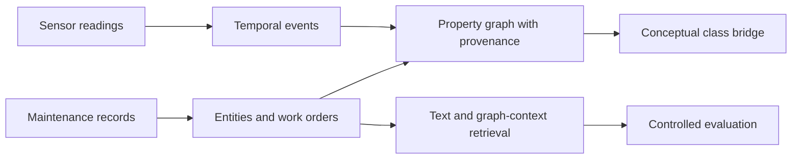

<!-- section: introduction -->
# Industrial-KG Fusion

Forschungsprototyp zur Darstellung von Sensorereignissen und Wartungsaufträgen in einem Property Graph sowie zum Vergleich von Textsuche und Graphkontext. Er nutzt öffentliche Daten und bewahrt die negativen Befunde, die zur strengeren Evaluation geführt haben.

[English](README.md) · [Español](README.es.md) · [Português](README.pt.md) · [Deutsch](README.de.md) · [Français](README.fr.md)

<!-- section: research-question -->
## Forschungsfrage

Liefert der Entitätskontext des Graphen zusätzliche Information gegenüber einer Textreferenz, wenn Kennungen und Textvorlagen kontrolliert werden? Das aktuelle Experiment untersucht synthetische Anlagenkennungen, keine verifizierte physische Identität.

<!-- section: architecture -->
## Architektur

<!-- shared: architecture -->

<!-- /shared -->

Die Zweige teilen konzeptuelle Klassen, keine Maschinenidentität. Die Suche nutzt den Wartungszweig; ein Relevanzbezug zwischen Sensoren und Aufträgen ist nicht validiert. Siehe [Architektur](docs/ARCHITECTURE.md) und [Schema](docs/KG_SCHEMA.md).

<!-- section: data -->
## Daten

- [MetroPT-3](https://archive.ics.uci.edu/dataset/791/metropt+3+dataset): reale Sensormessungen eines Kompressors.
- [Wartungsdatensatz](https://huggingface.co/datasets/Jvachier/industrial-maintenance-synthetic): eingefrorene Stichprobe synthetischer Aufträge.

Die unabhängigen Quellen beschreiben nicht dieselben Maschinen. [Quell-Hashes](data/raw/source_snapshot.json) identifizieren die Eingaben; die genaue Wartungsstichprobe wird nicht über Git verteilt und ihre Upstream-Version ist unbekannt.

<!-- section: pipeline -->
## Pipeline

- **00–04:** Datenprüfung, Ereignis- und Entitätsextraktion, Aufbau der Zweige und konzeptuelle Verbindung.
- **05:** die erste Kategoriendiagnostik zeigt eine leichte Aufgabe mit textbasierten Labels und wiederholten Vorlagen.
- **06:** strengere Suche für bekannte Anlagen maskiert Kennungen und schließt dieselbe Zeile, denselben Auftrag und dieselbe normalisierte Vorlage aus; Repräsentationen werden nur an Kandidaten angepasst.
- **07:** spätere Optimierung wählt anhand von Entwicklungsabfragen; die Bestätigung zeigt keinen gesicherten Gewinn.
- **08:** Identitätsprüfung und reine Problemabfragen bereiten eine verblindete technische Relevanzprüfung vor; menschliche Labels fehlen noch.

<!-- section: main-results -->
## Hauptergebnisse

Suche für bekannte Anlagen in Notebook 06:

<!-- shared: results -->
| Representation | Hit@10 | MRR@50 |
| --- | --- | --- |
| Graph context full | 2.267% | 0.008430 |
| Masked TF-IDF | 3.333% | 0.014559 |
| Hybrid RRF | 3.333% | 0.009785 |
| Random expectation | 0.221% | 0.000994 |

| Sensor indicator | Value |
| --- | --- |
| Documented failure periods overlapped | 4/4 |
| Eligible windows flagged | 23.079% |
<!-- /shared -->

Graphkontext übertrifft die Zufallserwartung, Text bleibt insgesamt stärker. Die Kombination belegt keinen Vorteil gegenüber Text: gleiches Hit@10 und niedrigeres MRR@50. Die spätere Optimierung mit Wörtern+Zeichen bestätigte keine Verbesserung.

Sensorereignisse überlappen alle dokumentierten Ausfallperioden bei hoher Alarmbelastung. Das ist zeitliche Abdeckung, keine validierte Diagnose oder Frühwarnung. Die Quellenintegration ist konzeptuell.

[Vollständige Ergebnisse, Intervalle und zwölf Hypothesen](docs/RESULT_TRACEABILITY.md) · [Forschungsrahmen und nächste Fragen](docs/RESEARCH_POSITIONING.md).

<!-- section: reproducibility -->
## Reproduzierbarkeit

Python 3.12 im Stammverzeichnis verwenden. Vor Vorprüfung oder vollständiger Ausführung die genauen Eingabedateien wiederherstellen:

<!-- shared: commands -->
```sh
python -m pip install -r requirements.txt
python tools/preflight.py --environment
python -m unittest discover -s tests
python tools/research_audit.py
python tools/run_pipeline.py
```
<!-- /shared -->

Tests und Prüfung gespeicherter Artefakte benötigen keine Rohdaten. Die vollständige Ausführung verlangt beide dokumentierten Hashes und lehnt Ersatzdateien ab. `python tools/run_pipeline.py --verify` wiederholt die Notebooks in getrennten frischen Kernels und vergleicht Artefakte. Vor dem Überschreiben werden frühere Ergebnisse lokal archiviert. [Datenzugang und Prüfungsumfang](docs/REPRODUCIBILITY.md) unterscheidet historische Wiederholungen von aktuellen Prüfungen.

<!-- section: relevance-review -->
## Relevanzprüfung

[Offline-Prüfseite](review/index.html) öffnen. Sie verbirgt Methode und Rang und exportiert Annotationen. Dateien der Prüfenden getrennt von generierten Vorlagen speichern; erneute Generierung überschreibt Vorlagen. Stufen: 0 irrelevant, 1 verwandt, aber nicht wiederverwendbar, 2 mit Anpassung nützlich und 3 unmittelbar nützlich. Unverträglichkeit, prüfende Person und Begründung erfassen; Entwicklung vor Bestätigung prüfen.

<!-- shared: review -->
```sh
python tools/evaluate_independent_review.py --labels annotations.csv --split development
python tools/evaluate_independent_review.py --labels annotations.csv --split confirmation
```
<!-- /shared -->

Die Auswertung verlangt sämtliche unveränderten Originalpaare der gewählten Gruppe. Menschliche Relevanz- und Sicherheitsannotationen stehen noch aus.

<!-- section: limitations -->
## Einschränkungen

- Synthetische Aufträge weisen erhebliche Unterschiede zwischen strukturierten und textlichen Identitäten auf.
- Diagnose-Labels stammen aus dem Text; Extraktion und technische Relevanz benötigen menschliche Prüfung.
- Gemeinsame physische Kennungen fehlen; Alarmspezifität und Vorwarnzeit sind nicht validiert.
- Die Suche nutzt direkte Entitätsmerkmale, kein Graphlernen; verfügbare Information variiert zwischen Repräsentationen.
- Unsicherheit gilt für einen festen Korpus und feste Seeds; Vergleiche sind explorativ und ohne Multiplizitätskorrektur.
- Vollständige öffentliche Reproduktion erfordert die historische Wartungsstichprobe. Softwarelizenz und Weiterverteilung sind ungeklärt.

Siehe [Evaluationsprotokoll](results/retrieval/asset/protocol.json).

<!-- section: repository-structure -->
## Repository-Struktur

<!-- shared: structure -->
```text
notebooks/     00–08: research sequence
src/           extraction, graph, retrieval and evaluation
config/        property-graph schema
tools/         execution, audits, reporting and review
results/       saved scientific artifacts
docs/          methods, evidence and research scope
tests/         methodological contracts
review/        offline annotation page
translations/  localized README sections
```
<!-- /shared -->

Große Rohdaten, Graphexporte, Caches und lokale Archive sind von Git ausgeschlossen.

<!-- section: author -->
## Autor

Marco Fidel Mayta Quispe  
Doktorand im direkten Promotionsprogramm  
ICMC — Universität São Paulo
