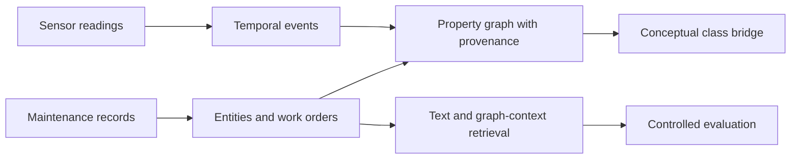

<!-- section: introduction -->
# Industrial-KG Fusion

Prototipo de investigación para representar eventos de sensores y registros de mantenimiento en un grafo de propiedades y comparar recuperación textual y contexto del grafo. Usa datos públicos y conserva los resultados negativos que motivaron una evaluación más estricta.

[English](README.md) · [Español](README.es.md) · [Português](README.pt.md) · [Deutsch](README.de.md) · [Français](README.fr.md)

<!-- section: research-question -->
## Pregunta de investigación

¿El contexto de entidades del grafo aporta información útil para recuperar registros frente a un baseline textual, tras controlar identificadores y plantillas? El experimento actual utiliza etiquetas de activos sintéticos, no identidad física verificada.

<!-- section: architecture -->
## Arquitectura

<!-- shared: architecture -->

<!-- /shared -->

Las ramas comparten clases conceptuales, no identidad de máquinas. La recuperación utiliza mantenimiento; no hay un vínculo de relevancia validado entre sensores y órdenes. Véanse [arquitectura](docs/ARCHITECTURE.md) y [esquema](docs/KG_SCHEMA.md).

<!-- section: data -->
## Datos

- [MetroPT-3](https://archive.ics.uci.edu/dataset/791/metropt+3+dataset): mediciones reales de sensores de un compresor.
- [Dataset de mantenimiento](https://huggingface.co/datasets/Jvachier/industrial-maintenance-synthetic): muestra congelada de órdenes sintéticas.

Son fuentes independientes que no describen las mismas máquinas. Los [hashes de origen](data/raw/source_snapshot.json) identifican los inputs; la muestra exacta de mantenimiento no se distribuye en Git y su revisión upstream es desconocida.

<!-- section: pipeline -->
## Pipeline

- **00–04:** auditoría, extracción de eventos y entidades, construcción de ramas y puente conceptual.
- **05:** el diagnóstico inicial revela una tarea fácil con etiquetas derivadas del texto y plantillas repetidas.
- **06:** recuperación más estricta de activos conocidos: enmascara identificadores y excluye misma fila, orden y plantilla normalizada; las representaciones se ajustan solo a candidatos.
- **07:** la optimización posterior selecciona con consultas de desarrollo; confirmación no demuestra mejora.
- **08:** auditoría de identidad y consultas basadas solo en el problema preparan revisión técnica ciega; faltan etiquetas humanas.

<!-- section: main-results -->
## Resultados principales

Recuperación de activos conocidos en el notebook 06:

<!-- shared: results -->
| Representation | Hit@10 | MRR@50 |
| --- | --- | --- |
| Graph context full | 2.267% | 0.008430 |
| Masked TF-IDF | 3.333% | 0.014559 |
| Hybrid RRF | 3.333% | 0.009785 |
| Random expectation | 0.221% | 0.000994 |

| Sensor indicator | Value |
| --- | --- |
| Documented failure periods overlapped | 4/4 |
| Eligible windows flagged | 23.079% |
<!-- /shared -->

El contexto del grafo supera la expectativa aleatoria, pero texto es más fuerte en conjunto. La fusión no demuestra ventaja sobre texto: igual Hit@10 y menor MRR@50. La optimización posterior con palabras+caracteres no confirmó mejora.

Los eventos solapan todos los períodos de falla documentados, con una carga alta de alertas. Es cobertura temporal, no diagnóstico ni anticipación validados. La integración entre fuentes es conceptual.

[Resultados completos, intervalos y doce hipótesis](docs/RESULT_TRACEABILITY.md) · [Alcance y próximas preguntas](docs/RESEARCH_POSITIONING.md).

<!-- section: reproducibility -->
## Reproducibilidad

Usar Python 3.12 desde la raíz. Restaurar los inputs exactos antes del preflight o la ejecución completa:

<!-- shared: commands -->
```sh
python -m pip install -r requirements.txt
python tools/preflight.py --environment
python -m unittest discover -s tests
python tools/research_audit.py
python tools/run_pipeline.py
```
<!-- /shared -->

Los tests y la verificación de artefactos guardados pueden ejecutarse sin datos raw. La ejecución completa exige ambos hashes documentados y rechaza sustituciones. `python tools/run_pipeline.py --verify` repite los notebooks con kernels limpios separados y compara artefactos. Los resultados anteriores se archivan localmente antes de reemplazarlos. [Acceso a datos y alcance de la verificación](docs/REPRODUCIBILITY.md) distingue repeticiones históricas de comprobaciones actuales.

<!-- section: relevance-review -->
## Revisión de relevancia

Abrir [la página de revisión offline](review/index.html). Oculta método y posición y exporta anotaciones. Guardar por separado los archivos de cada revisor: regenerar sobrescribe las plantillas. Grados: 0 irrelevante, 1 relacionado pero no reutilizable, 2 útil con adaptación y 3 directamente útil. Registrar incompatibilidad, revisor y justificación; revisar desarrollo antes de confirmación.

<!-- shared: review -->
```sh
python tools/evaluate_independent_review.py --labels annotations.csv --split development
python tools/evaluate_independent_review.py --labels annotations.csv --split confirmation
```
<!-- /shared -->

El evaluador exige todos los pares originales, sin cambios, para el grupo seleccionado. Las anotaciones humanas de relevancia y seguridad están pendientes.

<!-- section: limitations -->
## Limitaciones

- Las órdenes sintéticas presentan discordancia considerable entre identidades estructuradas y textuales.
- Las etiquetas del diagnóstico derivan del texto; extracción y relevancia técnica necesitan revisión humana.
- No hay identificadores físicos compartidos; especificidad de alertas y anticipación no están validadas.
- La recuperación usa entidades de un salto, no aprendizaje sobre grafos; la información disponible difiere entre representaciones.
- La incertidumbre depende del corpus y semillas fijos; las comparaciones son exploratorias, sin ajuste de multiplicidad.
- La reproducción pública completa exige la muestra histórica de mantenimiento. Licencia de software y redistribución siguen pendientes.

Véase el [protocolo de evaluación](results/retrieval/asset/protocol.json).

<!-- section: repository-structure -->
## Estructura del repositorio

<!-- shared: structure -->
```text
notebooks/     00–08: research sequence
src/           extraction, graph, retrieval and evaluation
config/        property-graph schema
tools/         execution, audits, reporting and review
results/       saved scientific artifacts
docs/          methods, evidence and research scope
tests/         methodological contracts
review/        offline annotation page
translations/  localized README sections
```
<!-- /shared -->

Datos raw grandes, exportaciones del grafo, cachés y archivos históricos locales quedan fuera de Git.

<!-- section: author -->
## Autor

Marco Fidel Mayta Quispe  
Estudiante de Doctorado Directo  
ICMC — Universidad de São Paulo
