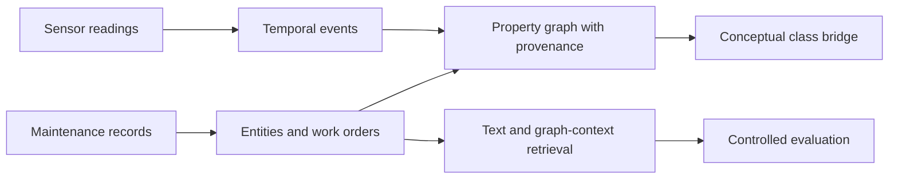

<!-- section: introduction -->
# Industrial-KG Fusion

Prototype de recherche pour représenter des événements de capteurs et des dossiers de maintenance dans un graphe de propriétés, puis comparer recherche textuelle et contexte du graphe. Il utilise des données publiques et conserve les résultats négatifs qui ont guidé l’évaluation.

[English](README.md) · [Español](README.es.md) · [Português](README.pt.md) · [Deutsch](README.de.md) · [Français](README.fr.md)

<!-- section: research-question -->
## Question de recherche

Le contexte des entités du graphe apporte-t-il une information utile au-delà d’une référence textuelle, après contrôle des identifiants et des modèles de texte ? L’expérience actuelle utilise des étiquettes d’actifs synthétiques, sans identité physique vérifiée.

<!-- section: architecture -->
## Architecture

<!-- shared: architecture -->

<!-- /shared -->

Les branches partagent des classes conceptuelles, pas l’identité des machines. La recherche utilise la maintenance ; aucun lien de pertinence entre capteurs et ordres n’est validé. Voir [architecture](docs/ARCHITECTURE.md) et [schéma](docs/KG_SCHEMA.md).

<!-- section: data -->
## Données

- [MetroPT-3](https://archive.ics.uci.edu/dataset/791/metropt+3+dataset) : mesures réelles de capteurs d’un compresseur.
- [Dataset de maintenance](https://huggingface.co/datasets/Jvachier/industrial-maintenance-synthetic) : échantillon figé d’ordres synthétiques.

Ces sources indépendantes ne décrivent pas les mêmes machines. Les [empreintes des sources](data/raw/source_snapshot.json) identifient les entrées ; l’échantillon exact de maintenance n’est pas distribué dans Git et sa révision upstream est inconnue.

<!-- section: pipeline -->
## Pipeline

- **00–04** : audit, extraction des événements et entités, construction des branches et lien conceptuel.
- **05** : le diagnostic initial révèle une tâche facile, avec des étiquettes dérivées du texte et des modèles répétés.
- **06** : recherche plus stricte pour des actifs connus : identifiants masqués, exclusion de la même ligne, du même ordre et du même modèle normalisé ; représentations ajustées uniquement aux candidats.
- **07** : l’optimisation ultérieure sélectionne sur les requêtes de développement ; la confirmation n’établit pas de gain.
- **08** : audit d’identité et requêtes limitées au problème préparent une revue technique en aveugle ; les annotations humaines restent à faire.

<!-- section: main-results -->
## Résultats principaux

Recherche pour des actifs connus dans le notebook 06 :

<!-- shared: results -->
| Representation | Hit@10 | MRR@50 |
| --- | --- | --- |
| Graph context full | 2.267% | 0.008430 |
| Masked TF-IDF | 3.333% | 0.014559 |
| Hybrid RRF | 3.333% | 0.009785 |
| Random expectation | 0.221% | 0.000994 |

| Sensor indicator | Value |
| --- | --- |
| Documented failure periods overlapped | 4/4 |
| Eligible windows flagged | 23.079% |
<!-- /shared -->

Le contexte du graphe dépasse l’attente aléatoire, mais le texte reste globalement plus fort. La combinaison n’établit aucun avantage sur le texte : Hit@10 identique et MRR@50 inférieur. L’optimisation ultérieure mots+caractères n’a pas confirmé d’amélioration.

Les événements recouvrent toutes les périodes de panne documentées, avec une forte charge d’alertes. Il s’agit de couverture temporelle, pas d’un diagnostic ou d’une alerte précoce validés. L’intégration entre sources est conceptuelle.

[Résultats complets, intervalles et douze hypothèses](docs/RESULT_TRACEABILITY.md) · [Portée et prochaines questions](docs/RESEARCH_POSITIONING.md).

<!-- section: reproducibility -->
## Reproductibilité

Utiliser Python 3.12 depuis la racine. Restaurer les entrées exactes avant les contrôles préalables ou l’exécution complète :

<!-- shared: commands -->
```sh
python -m pip install -r requirements.txt
python tools/preflight.py --environment
python -m unittest discover -s tests
python tools/research_audit.py
python tools/run_pipeline.py
```
<!-- /shared -->

Les tests et la vérification des artefacts sauvegardés peuvent fonctionner sans données brutes. L’exécution complète exige les deux empreintes documentées et refuse les substitutions. `python tools/run_pipeline.py --verify` répète les notebooks dans des noyaux propres distincts et compare les artefacts. Les résultats précédents sont archivés localement avant remplacement. [Accès aux données et portée des vérifications](docs/REPRODUCIBILITY.md) distingue répétitions historiques et contrôles actuels.

<!-- section: relevance-review -->
## Revue de pertinence

Ouvrir [la page de revue hors ligne](review/index.html). Elle masque méthode et rang et exporte les annotations. Conserver séparément les fichiers des évaluateurs : la régénération écrase les modèles. Notes : 0 non pertinent, 1 lié mais non réutilisable, 2 utile avec adaptation et 3 directement utile. Indiquer incompatibilité, évaluateur et justification ; examiner le développement avant la confirmation.

<!-- shared: review -->
```sh
python tools/evaluate_independent_review.py --labels annotations.csv --split development
python tools/evaluate_independent_review.py --labels annotations.csv --split confirmation
```
<!-- /shared -->

L’évaluateur exige tous les couples d’origine, sans modification, pour le groupe choisi. Les annotations humaines de pertinence et de sécurité restent à faire.

<!-- section: limitations -->
## Limites

- Les ordres synthétiques présentent d’importants désaccords entre identités structurées et textuelles.
- Les étiquettes du diagnostic proviennent du texte ; extraction et pertinence technique nécessitent une revue humaine.
- Les sources n’ont pas d’identifiants physiques communs ; spécificité des alertes et anticipation ne sont pas validées.
- La recherche utilise des entités directement voisines, sans apprentissage sur graphes ; l’information disponible diffère entre représentations.
- L’incertitude dépend d’un corpus et de graines fixes ; les comparaisons sont exploratoires, sans correction de multiplicité.
- La reproduction publique complète exige l’échantillon historique de maintenance. Licence logicielle et redistribution restent à préciser.

Voir le [protocole d’évaluation](results/retrieval/asset/protocol.json).

<!-- section: repository-structure -->
## Structure du dépôt

<!-- shared: structure -->
```text
notebooks/     00–08: research sequence
src/           extraction, graph, retrieval and evaluation
config/        property-graph schema
tools/         execution, audits, reporting and review
results/       saved scientific artifacts
docs/          methods, evidence and research scope
tests/         methodological contracts
review/        offline annotation page
translations/  localized README sections
```
<!-- /shared -->

Données brutes volumineuses, exports du graphe, caches et archives locales sont exclus de Git.

<!-- section: author -->
## Auteur

Marco Fidel Mayta Quispe  
Doctorant en admission directe  
ICMC — Université de São Paulo
