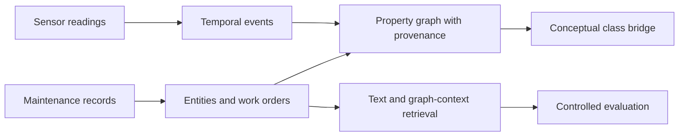

<!-- section: introduction -->
# Industrial-KG Fusion

A research prototype for representing sensor events and maintenance records in a property graph, then comparing text and graph-context retrieval. It uses public data and retains the negative findings that shaped the evaluation.

[English](README.md) · [Español](README.es.md) · [Português](README.pt.md) · [Deutsch](README.de.md) · [Français](README.fr.md)

<!-- section: research-question -->
## Research question

Does graph-derived entity context add useful retrieval information beyond a text baseline after identifier and template controls? The current experiment tests this on synthetic asset labels, not verified physical identity.

<!-- section: architecture -->
## Architecture

<!-- shared: architecture -->

<!-- /shared -->

The branches share conceptual classes, not machine identity. Retrieval uses the maintenance branch; no sensor-to-work-order relevance link is validated. See [architecture](docs/ARCHITECTURE.md) and [schema](docs/KG_SCHEMA.md).

<!-- section: data -->
## Data

- [MetroPT-3](https://archive.ics.uci.edu/dataset/791/metropt+3+dataset): real compressor sensor measurements.
- [Maintenance dataset](https://huggingface.co/datasets/Jvachier/industrial-maintenance-synthetic): a frozen sample of synthetic work orders.

These independent sources do not describe the same machines. [Source hashes](data/raw/source_snapshot.json) identify the inputs; the exact maintenance snapshot is not distributed in Git and its upstream revision is unknown.

<!-- section: pipeline -->
## Pipeline

- **00–04:** audit data, extract sensor events and text entities, build the source branches and concept bridge.
- **05:** initial category diagnostic reveals an easy task with text-derived labels and repeated templates.
- **06:** stricter known-asset retrieval masks identifiers and excludes the same row, work order and normalized template; representations fit candidates only.
- **07:** subsequent optimization selects on development queries; confirmation does not establish a gain.
- **08:** identity audit and problem-only retrieval prepare blinded technical relevance review; human labels remain pending.

<!-- section: main-results -->
## Main results

Known-asset retrieval in notebook 06:

<!-- shared: results -->
| Representation | Hit@10 | MRR@50 |
| --- | --- | --- |
| Graph context full | 2.267% | 0.008430 |
| Masked TF-IDF | 3.333% | 0.014559 |
| Hybrid RRF | 3.333% | 0.009785 |
| Random expectation | 0.221% | 0.000994 |

| Sensor indicator | Value |
| --- | --- |
| Documented failure periods overlapped | 4/4 |
| Eligible windows flagged | 23.079% |
<!-- /shared -->

Graph context exceeds random expectation, but text remains stronger overall. Hybrid retrieval does not establish an advantage over text: Hit@10 is equal and MRR@50 is lower. Subsequent words+characters optimization did not confirm an improvement.

Sensor events overlap every documented failure period with a high alert burden. This is temporal coverage, not validated diagnosis or early warning. Cross-source integration is conceptual.

[Full results, intervals and twelve hypotheses](docs/RESULT_TRACEABILITY.md) · [Research scope and next questions](docs/RESEARCH_POSITIONING.md).

<!-- section: reproducibility -->
## Reproducibility

Use Python 3.12 from the repository root. Restore the exact raw inputs before preflight or full execution:

<!-- shared: commands -->
```sh
python -m pip install -r requirements.txt
python tools/preflight.py --environment
python -m unittest discover -s tests
python tools/research_audit.py
python tools/run_pipeline.py
```
<!-- /shared -->

Tests and saved-artifact verification can run without the raw snapshots. Full execution requires both documented input hashes; the runner refuses substitutions. `python tools/run_pipeline.py --verify` repeats all notebooks in separate clean kernels and compares artifacts. Prior results are archived locally before replacement. [Data access and verification scope](docs/REPRODUCIBILITY.md) distinguishes historical repetition from current checks.

<!-- section: relevance-review -->
## Relevance review

Open [the offline review page](review/index.html). It hides method and rank and exports annotations. Keep reviewer files separate from generated templates; regeneration overwrites templates. Grades are 0 irrelevant, 1 related but not reusable, 2 useful with adaptation and 3 directly useful. Record incompatibility, reviewer and rationale; review development before confirmation.

<!-- shared: review -->
```sh
python tools/evaluate_independent_review.py --labels annotations.csv --split development
python tools/evaluate_independent_review.py --labels annotations.csv --split confirmation
```
<!-- /shared -->

The evaluator requires complete, unchanged pairs for the selected split. Human relevance and safety annotations remain pending.

<!-- section: limitations -->
## Limitations

- Synthetic work orders have substantial disagreement between structured and textual identities.
- Text-derived diagnostic labels are not independent ground truth; extraction and technical relevance still need human review.
- Sources have no shared physical identifiers; sensor alert specificity and lead time are unvalidated.
- Retrieval uses one-hop entity features, not graph learning; feature availability differs across representations.
- Uncertainty is conditional on a fixed corpus and seeds; comparisons are exploratory and multiplicity is unadjusted.
- Exact public end-to-end reproduction requires access to the historical maintenance snapshot. Software licensing and snapshot redistribution remain unresolved.

See the [evaluation protocol](results/retrieval/asset/protocol.json).

<!-- section: repository-structure -->
## Repository structure

<!-- shared: structure -->
```text
notebooks/     00–08: research sequence
src/           extraction, graph, retrieval and evaluation
config/        property-graph schema
tools/         execution, audits, reporting and review
results/       saved scientific artifacts
docs/          methods, evidence and research scope
tests/         methodological contracts
review/        offline annotation page
translations/  localized README sections
```
<!-- /shared -->

Large raw inputs, graph exports, caches and local archives are excluded from Git.

<!-- section: author -->
## Author

Marco Fidel Mayta Quispe  
Direct PhD Student  
ICMC — University of São Paulo
