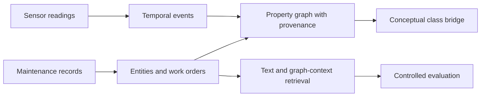

<!-- section: introduction -->
# Industrial-KG Fusion

Protótipo de pesquisa para representar eventos de sensores e registros de manutenção em um grafo de propriedades e comparar recuperação textual e contexto do grafo. Usa dados públicos e preserva os resultados negativos que orientaram a avaliação.

[English](README.md) · [Español](README.es.md) · [Português](README.pt.md) · [Deutsch](README.de.md) · [Français](README.fr.md)

<!-- section: research-question -->
## Questão de pesquisa

O contexto de entidades do grafo acrescenta informação útil à recuperação em relação a uma referência textual, após controles de identificadores e modelos de texto? O experimento atual usa rótulos de ativos sintéticos, sem identidade física verificada.

<!-- section: architecture -->
## Arquitetura

<!-- shared: architecture -->

<!-- /shared -->

Os ramos compartilham classes conceituais, não identidade de máquinas. A recuperação usa manutenção; não há vínculo de relevância validado entre sensores e ordens. Consulte [arquitetura](docs/ARCHITECTURE.md) e [esquema](docs/KG_SCHEMA.md).

<!-- section: data -->
## Dados

- [MetroPT-3](https://archive.ics.uci.edu/dataset/791/metropt+3+dataset): medições reais de sensores de um compressor.
- [Dataset de manutenção](https://huggingface.co/datasets/Jvachier/industrial-maintenance-synthetic): amostra congelada de ordens sintéticas.

As fontes são independentes e não descrevem as mesmas máquinas. Os [hashes de origem](data/raw/source_snapshot.json) identificam os arquivos; a amostra exata de manutenção não é distribuída no Git e sua revisão upstream é desconhecida.

<!-- section: pipeline -->
## Pipeline

- **00–04:** auditoria, extração de eventos e entidades, construção dos ramos e ligação conceitual.
- **05:** o diagnóstico inicial revela uma tarefa fácil com rótulos derivados do texto e modelos repetidos.
- **06:** recuperação mais rigorosa de ativos conhecidos: mascara identificadores e exclui a mesma linha, ordem e modelo normalizado; representações são ajustadas apenas aos candidatos.
- **07:** a otimização posterior seleciona nas consultas de desenvolvimento; a confirmação não estabelece ganho.
- **08:** auditoria de identidade e consultas com apenas o problema preparam revisão técnica cega; os rótulos humanos estão pendentes.

<!-- section: main-results -->
## Resultados principais

Recuperação de ativos conhecidos no notebook 06:

<!-- shared: results -->
| Representation | Hit@10 | MRR@50 |
| --- | --- | --- |
| Graph context full | 2.267% | 0.008430 |
| Masked TF-IDF | 3.333% | 0.014559 |
| Hybrid RRF | 3.333% | 0.009785 |
| Random expectation | 0.221% | 0.000994 |

| Sensor indicator | Value |
| --- | --- |
| Documented failure periods overlapped | 4/4 |
| Eligible windows flagged | 23.079% |
<!-- /shared -->

O contexto do grafo supera a expectativa aleatória, mas texto permanece mais forte no conjunto. A combinação não estabelece vantagem sobre texto: Hit@10 igual e MRR@50 menor. A otimização posterior com palavras+caracteres não confirmou melhoria.

Os eventos sobrepõem todos os períodos de falha documentados, com alta carga de alertas. Isso representa cobertura temporal, não diagnóstico ou aviso antecipado validados. A integração entre fontes é conceitual.

[Resultados completos, intervalos e doze hipóteses](docs/RESULT_TRACEABILITY.md) · [Escopo e próximas questões](docs/RESEARCH_POSITIONING.md).

<!-- section: reproducibility -->
## Reprodutibilidade

Use Python 3.12 na raiz do repositório. Restaure os arquivos exatos antes do preflight ou da execução completa:

<!-- shared: commands -->
```sh
python -m pip install -r requirements.txt
python tools/preflight.py --environment
python -m unittest discover -s tests
python tools/research_audit.py
python tools/run_pipeline.py
```
<!-- /shared -->

Os testes e a verificação dos artefatos salvos podem rodar sem dados raw. A execução completa exige ambos os hashes documentados e recusa substituições. `python tools/run_pipeline.py --verify` repete os notebooks em kernels limpos separados e compara artefatos. Resultados anteriores são arquivados localmente antes da substituição. [Acesso aos dados e escopo da verificação](docs/REPRODUCIBILITY.md) distingue repetições históricas das verificações atuais.

<!-- section: relevance-review -->
## Revisão de relevância

Abra [a página de revisão offline](review/index.html). Ela oculta método e posição e exporta anotações. Guarde arquivos de cada revisor separadamente: a regeneração sobrescreve os modelos. Graus: 0 irrelevante, 1 relacionado, mas não reutilizável, 2 útil com adaptação e 3 diretamente útil. Registre incompatibilidade, revisor e justificativa; revise desenvolvimento antes de confirmação.

<!-- shared: review -->
```sh
python tools/evaluate_independent_review.py --labels annotations.csv --split development
python tools/evaluate_independent_review.py --labels annotations.csv --split confirmation
```
<!-- /shared -->

O avaliador exige todos os pares originais, sem alterações, para o grupo selecionado. As anotações humanas de relevância e segurança estão pendentes.

<!-- section: limitations -->
## Limitações

- As ordens sintéticas têm discordância substancial entre identidades estruturadas e textuais.
- Rótulos do diagnóstico derivam do texto; extração e relevância técnica precisam de revisão humana.
- Não há identificadores físicos compartilhados; especificidade dos alertas e antecedência não foram validadas.
- A recuperação usa entidades de um salto, não aprendizado em grafos; a informação disponível varia entre representações.
- A incerteza depende de corpus e sementes fixos; comparações são exploratórias, sem ajuste de multiplicidade.
- A reprodução pública completa exige a amostra histórica de manutenção. Licença de software e redistribuição continuam pendentes.

Consulte o [protocolo de avaliação](results/retrieval/asset/protocol.json).

<!-- section: repository-structure -->
## Estrutura do repositório

<!-- shared: structure -->
```text
notebooks/     00–08: research sequence
src/           extraction, graph, retrieval and evaluation
config/        property-graph schema
tools/         execution, audits, reporting and review
results/       saved scientific artifacts
docs/          methods, evidence and research scope
tests/         methodological contracts
review/        offline annotation page
translations/  localized README sections
```
<!-- /shared -->

Dados raw grandes, exportações do grafo, caches e arquivos históricos locais ficam fora do Git.

<!-- section: author -->
## Autor

Marco Fidel Mayta Quispe  
Estudante de Doutorado Direto  
ICMC — Universidade de São Paulo
