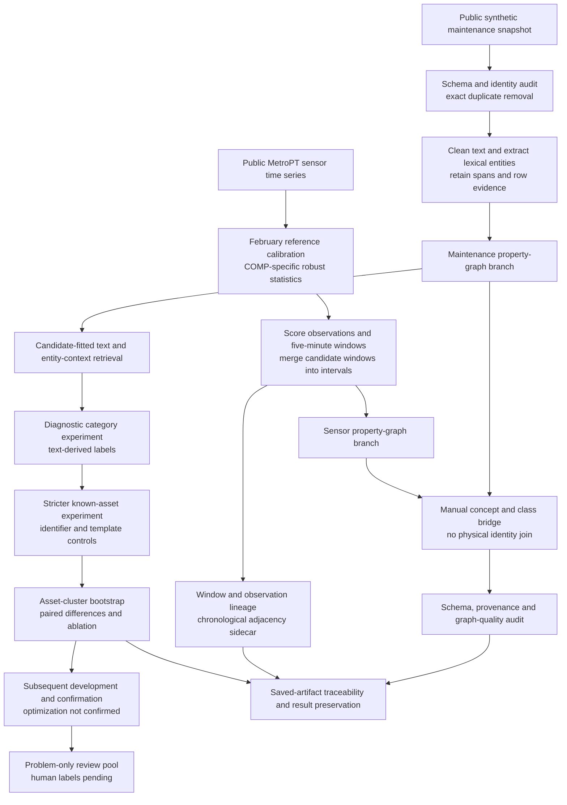

# Implemented architecture

This diagram describes current computations, not a proposed trained multimodal model. Retrieval uses the maintenance branch; the sensor branch contributes event modeling and conceptual navigation, but has no validated relevance link to maintenance candidates. Graph learning is a prospective research question rather than an implemented result.

Core implementations live under `src/`; notebooks retain experiment-specific protocol, cohort selection and analysis. `tools/run_pipeline.py` executes clean notebook kernels, preserves previous results before replacing them, and produces additive quality/temporal audits. `tools/research_audit.py` verifies saved numerical artifacts without rerunning expensive rankings.
